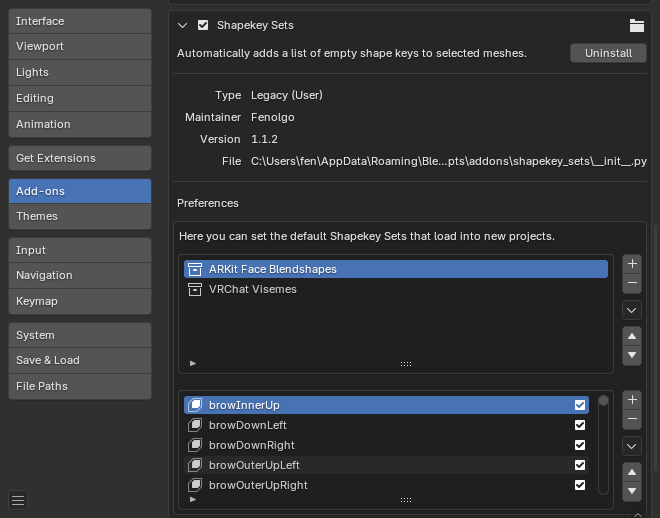

# Shapekey Sets

A Blender addon for quickly adding a list of empty shape keys to your objects.

## Installation

-   Download `shapekey_sets.zip` from the [latest release](https://github.com/Fenolgo/shapekey_sets/releases)
-   In Blender, go to Edit > Preferences > Add-ons and click the **Install...** button
-   Select the `shapekey_sets.zip` file you downloaded and click **Install Add-on**

## Usage

-   Select one or more Objects
-   Go to Properties > Data > Shapekey Sets
-   Select a Shapekey Set
-   Click "Apply Shapekey Set"

## Configuration

-   You can change the default Shapekey Sets in Edit > Preferences > Add-ons > Shapekey Sets

